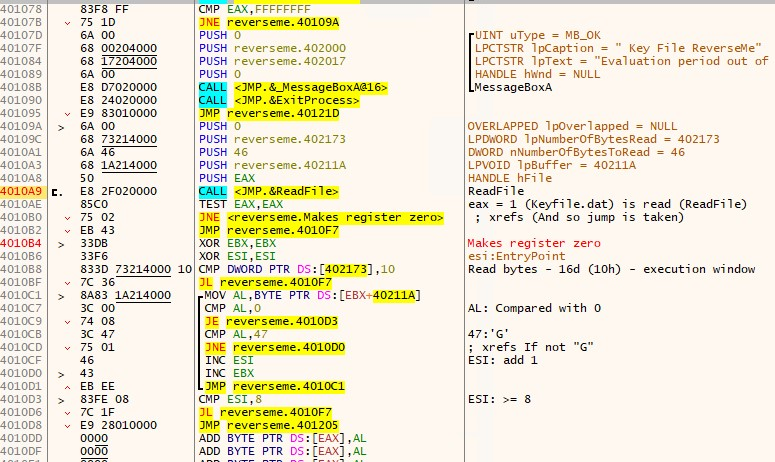

# Malware Research Vlog 4

## Software Patching

Load "reverseme.exe" into x32dbg:

```
reverseme.exe
SHA-1: DA612B980B3597C0D392B06E39739A9F2743A537
```

Patch File: reverseme.1337
```
>reverseme.exe
0000107B:75->74
000010B0:75->74
000010BF:7C->7F
000010D6:7C->7F
```

(Ctrl - P) = Patches Window

Import -> reverseme.1337 -> Patch File

File name: (something.exe)

## Serial Fishing



Create "keyfile.dat"

```
GGGGGGGG00000000

```

and Launch "reverseme.exe" and it works!

