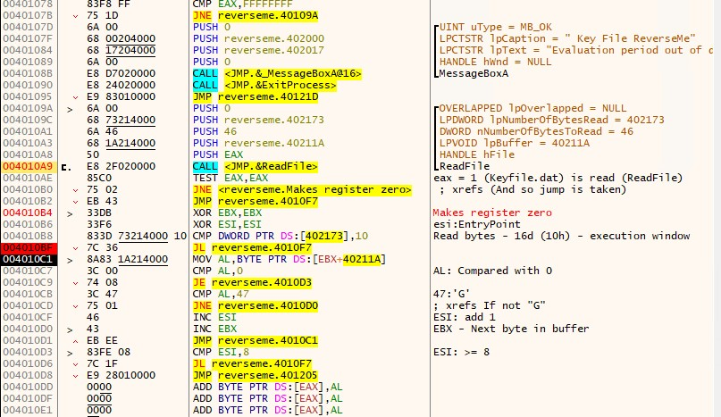

# Malware Research Vlog 4

## Software Patching

Load "reverseme.exe" into x32dbg:

```
Lena 151 Tutorial 1 + 2 - reverseme.exe
SHA-1: DA612B980B3597C0D392B06E39739A9F2743A537
```

Patch File: [reverseme.1337](reverseme.1337)

(Ctrl - P) = Patches Window

Import -> [reverseme.1337](reverseme.1337) -> Patch File

File name: (something.exe)

## Serial Fishing



Create [keyfile.dat](keyfile.dat)

and Launch "reverseme.exe" and it works!

