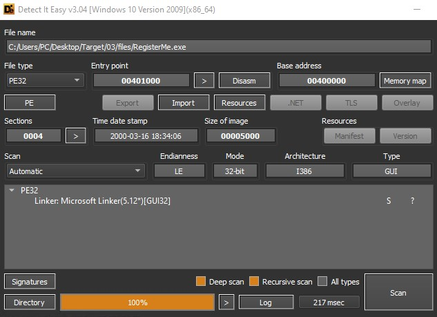

# Malware Research Vlog 5


## Basic Nag removal

```
Lena 151 Tutorial 3 - registerme.exe
SHA-1: 8E74F675EBB1C27EDD95C95CDC6AA935819ED158
```

### Source of information:
[Lenas Reversing for Newbies](https://forum.tuts4you.com/files/file/1307-lenas-reversing-for-newbies)

### Scan & Patch File:



More info:
[Portable Executable (PE)](../PE.md)

Patch File: [RegisterMe_patch.1337](RegisterMe_patch.1337)


## Software Registering

```
Lena 151 Tutorial 4 - PixtopianBook.exe
SHA-1: E0E77313C50C5EEA136306A76AE15D5387D66DCE
```
Install (Unpack) + Run Application.

Next waste the trial features.
Try to Register the product.

### Steps:

Step 1: "bp MessageBoxA"
Step 2: Hit "Add Group" Button
Step 3: "Alt + F9" - (Back to User)
Step 4: Close Window
Step 5: At the Function (entrypoint).
Step 6: Step F8 - (Get out of Function)
Step 7: Scroll Up (to Find Compare ) -

```
00408B05 | 83F8 03 | CMP EAX, 3 | 3 groups already
```


Step 8: Modify (JL)

```
00408B08 | EB 2A | JMP pixtopianbook.408B34 |
```

Step 9: (Repeat Step 1, 3-8) : 
Step 9.2 - Hit "Add" on Toolbar.

(Find compare: More than 4 entries per group)
```
00412DD3 | EB 1A | JMP pixtopianbook.412DEF |
```

Edit (UnRegistered) lines:
Ctrl + G:
```
004E4BE6
004D4830
```

### Register

Patch File [PixtopianBook.1337](PixtopianBook.1337)